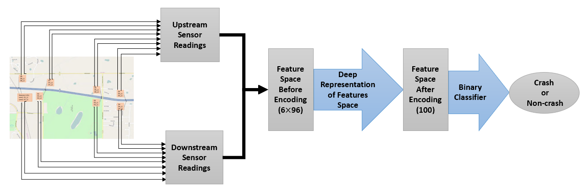
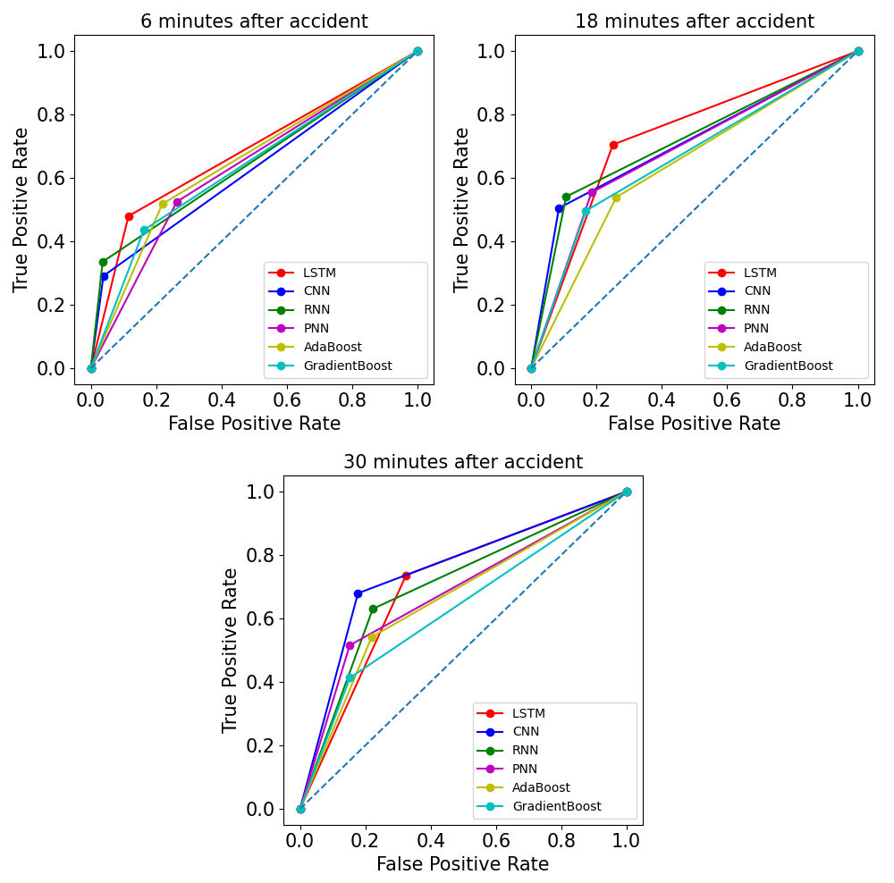

# [Deep Representation of Imbalanced Spatio-temporal Traffic Flow Data for Traffic Accident Detection (paper)](https://ietresearch.onlinelibrary.wiley.com/doi/full/10.1049/itr2.12287)

In this work, we attempted to detect road accidents using spatio-temporal features of automatic traffic counters. We demonstrated that using time-series encoder implemented by LSTM layers increases the class-separability of feature space. Furthermore, our proposed method outperformed existing methods on detection accuracy. 

  

## Contact
For any questions or suggestions please reach out to Shayan Shirahmad Gale Bagi [sshirahm@uwaterloo.ca](mailto:sshirahm@uwaterloo.ca)! 

## Abstract
Automatic detection of traffic accidents has a crucial
effect on improving transportation, public safety, and path
planning. Many lives can be saved by the consequent decrease
in the time between when the accidents occur and when rescue
teams are dispatched, and much travelling time can be saved
by notifying drivers to select alternative routes. This problem
is challenging mainly because of the rareness of accidents and
spatial heterogeneity of the environment. This paper studies
deep representation of loop detector data using Long-Short
Term Memory (LSTM) network for automatic detection of
freeway accidents. The LSTM-based framework increases class
separability in the encoded feature space while reducing the
dimension of data. Our experiments on real accident and loop
detector data collected from the Twin Cities Metro freeways of
Minnesota demonstrate that deep representation of traffic flow
data using LSTM network has the potential to detect freeway
accidents in less than 18 minutes with a true positive rate of
0.71 and a false positive rate of 0.25 which outperforms other
competing methods in the same arrangement.

## Main results

#### Detection on MnDOT dataset

  

### Installation

This work is implemented using Keras. Please install the packages listed in requirements.txt document.

### Evaluation and Training 

For Training and Evaluation of each model, run the corresponding code on the dataset of your own. The dataset used in this work cannot be published due to third-party restrictions. 

## Acknowlegement
We appreciate the help of Minnesota Department of Transportation (MnDOT) for providing us with the accident reports. 

